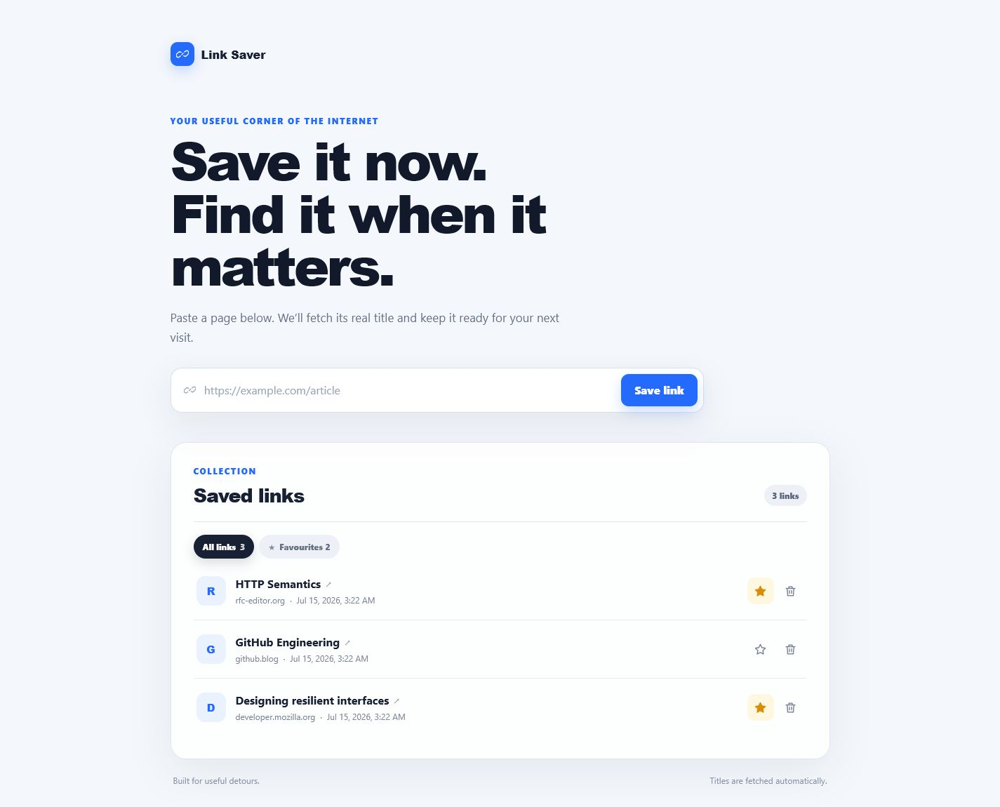
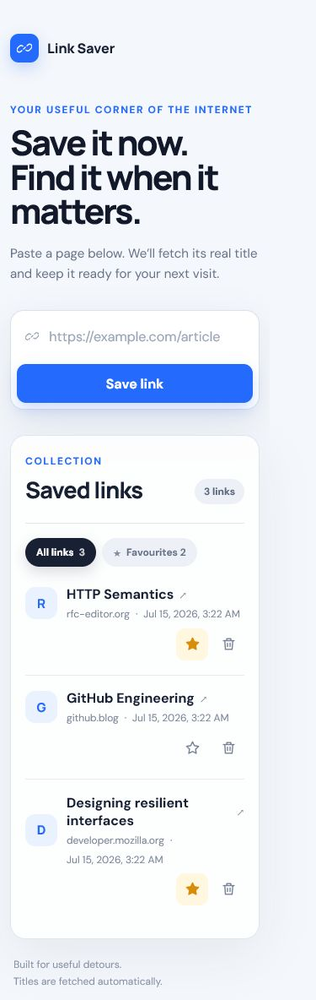

# Link Saver

[](https://github.com/egordushenko/link-saver/actions/workflows/ci.yml)
[](https://www.typescriptlang.org/)
[](https://nodejs.org/)

A focused full-stack link saver that fetches each page's real title, persists bookmarks in SQLite, and keeps favourites one click away.



## Features

- Paste a complete HTTP or HTTPS URL and fetch its `<title>` automatically.
- Keep links across restarts with a local SQLite database.
- Open, favourite, filter, and delete links from a responsive single-page interface.
- Handle duplicates, malformed URLs, unreachable pages, empty states, and missing records explicitly.
- Guard server-side fetches with address checks, redirect validation, timeout, content-type, and response-size limits.

## Run locally

Requirements: Node.js `^20.19.0 || >=22.12.0` and npm.

```bash
git clone https://github.com/egordushenko/link-saver.git
cd link-saver
npm install
npm run dev
```

Open [http://localhost:5173](http://localhost:5173). The Vite client proxies `/api` to Express on port `3000`. On Windows PowerShell with script execution disabled, use `npm.cmd` in place of `npm`.

Production mode:

```bash
npm run build
npm start
```

Then open [http://localhost:3000](http://localhost:3000). The database is created at `data/links.db` and is intentionally ignored by Git.

## Architecture

I chose React + Vite for a small, expressive UI and Express + SQLite for a backend that is easy to run and inspect. SQLite provides real persistence without asking the reviewer to provision infrastructure; the server is split into URL policy, metadata fetching, repository, and HTTP layers so each risk can be tested independently.

If the codebase had to grow, I would add an application/use-case layer between Express and the repository, introduce versioned database migrations, and move metadata fetching into a bounded background job. I would keep it as one deployable service until authentication, multi-user workloads, or independent scaling created a concrete reason to split it further.

| Area | Responsibility |
| --- | --- |
| `src/client` | React interface, local interaction state, API client, responsive styling |
| `src/server/url-policy.ts` | URL normalization, DNS resolution, private/reserved address rejection |
| `src/server/metadata.ts` | DNS-pinned HTTP(S), manual redirects, bounded HTML reads, title extraction and fallback |
| `src/server/link-repository.ts` | SQLite schema and prepared CRUD statements |
| `src/server/app.ts` | Express API, validation, status codes and safe error responses |
| `src/shared/link.ts` | Client/server wire types |

### API

| Method | Route | Result |
| --- | --- | --- |
| `GET` | `/api/links?favorite=true` | List all links or favourites |
| `POST` | `/api/links` | Validate URL, fetch title, persist link |
| `PATCH` | `/api/links/:id/favorite` | Set favourite state |
| `DELETE` | `/api/links/:id` | Delete a saved link |

Expected failures use stable JSON errors: `400` invalid input, `404` missing record, `409` duplicate URL, `413` oversized body, and `422` page metadata unavailable. Unexpected details are not disclosed to the client.

## Favourite feature change

The base save/list/delete flow was committed first. The follow-up favourite feature touched:

- `src/client/App.tsx` — favourite state, counts, optimistic update, filter and rollback.
- `src/client/api.ts` — favourite API request.
- `src/client/components/LinkItem.tsx` — accessible star action.
- `src/client/styles.css` — chips, selected star and filtered-empty state.
- `src/client/App.test.tsx` — toggle and filter interaction tests.
- `src/server/app.ts` and `src/server/link-repository.ts` — favourite endpoint and persistence (included in the server foundation).

The dedicated commit is `feat: add favourite filtering`.

These are the favourite-related files because the feature crosses each application boundary: `App.tsx` owns the filter and optimistic interaction state, `api.ts` carries the mutation, `LinkItem.tsx` exposes the accessible control, `styles.css` presents its states, the server files persist and query the flag, and `App.test.tsx` protects the user flow. Keeping those responsibilities separate avoids hiding persistence or API work inside a UI-only change.

## Tests and quality checks

```bash
npm run lint
npm run typecheck
npm run test:run
npm run build
# or all checks in sequence
npm run check
```

Vitest covers URL policy, DNS-pinned and bounded metadata fetching, SQLite persistence, API behaviour, and React interactions. Supertest exercises the API without a network listener; React Testing Library verifies the user-visible flows. GitHub Actions runs the full check on every push and pull request to `main` across Node 20.19, 22.12, and 24.

## Security boundary and assumptions

- The app is local and single-user; the server binds only to `127.0.0.1`, rejects non-loopback `Host` headers to prevent browser DNS rebinding, and has no authentication or authorization layer.
- Only HTTP/HTTPS URLs without embedded credentials are accepted.
- Every destination and redirect is resolved and checked against private, loopback, link-local, multicast, and reserved ranges; the validated IP is pinned into the connection while the original hostname is retained for Host and TLS SNI.
- HTML downloads are limited to 1 MB, three redirects, and eight seconds.
- A network-exposed or multi-tenant version would still require authentication, authorization, rate limiting, egress controls, and operational monitoring.
- Duplicate identity is the normalized URL with its fragment removed; query strings remain meaningful.

## Part B: existing-code review

The planted bugs, breaking inputs, severity ranking, and corrected implementation are documented in [REVIEW.md](REVIEW.md). The most severe findings are the arbitrary server-side fetch, startup crash, brittle title extraction, and destructive delete predicate that empties the collection because numeric IDs never equal string route parameters.

## AI-assisted workflow

The original request was broad, so I converted the brief into three operative prompts and used them as phase checkpoints. These are the working prompts that directed the implementation and review:

1. `Read the complete candidate brief, extract every acceptance criterion and ambiguity, compare a few restrained architectures, then lock a responsive visual direction before writing code.`
2. `Build the approved React + Express + SQLite design with test-first RED/GREEN cycles; keep title fetching bounded, pin validated DNS results, revalidate redirects, and use separate commits for the base flow and favourite change.`
3. `Audit the result against the brief, run lint, strict typecheck, tests, and production build; review the outbound-fetch and local-service trust boundaries; verify desktop and mobile UI; then make the public repository readable to a reviewer.`

I used AI as an implementation and review tool, while making the scope, architecture, error semantics, visual direction, and security trade-offs explicitly.

## What I would improve with more time

- Add authentication, request rate limits, and network-level egress policy before any shared deployment.
- Add Playwright browser tests and automated accessibility checks.
- Introduce versioned database migrations before the schema grows.
- Add search/tags only after observing a real collection large enough to need them.
- Deploy a live demo with managed persistence.

I deliberately left out authentication, multi-user sharing, tags, search, and live hosting because they are outside the focused local workflow. The required 3-minute screen recording is not linked yet; it remains the only outstanding submission artifact and will be produced separately rather than represented by a placeholder URL.

## Questions I would have asked before starting

I would have asked whether metadata failures should prevent saving or fall back to the hostname, whether URL fragments count as distinct bookmarks, and whether the expected reviewer environment permits native SQLite dependencies. I chose to reject unreachable/non-HTML pages, treat fragments as the same resource, preserve query strings, and document the supported Node versions.

<details>
<summary>Mobile view</summary>



</details>
